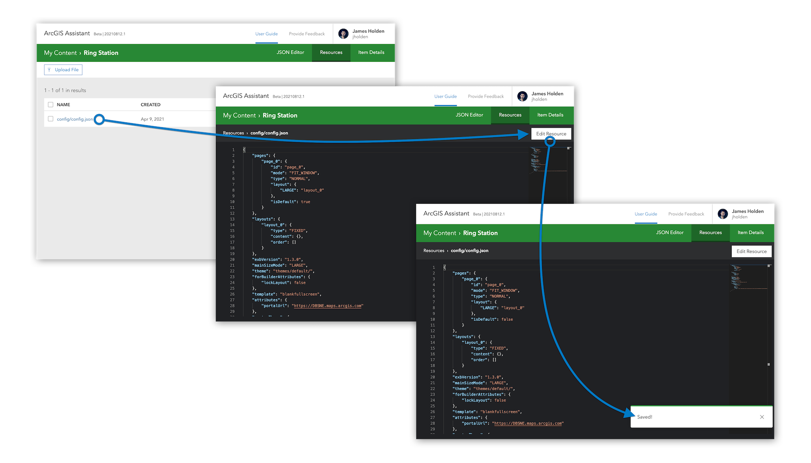
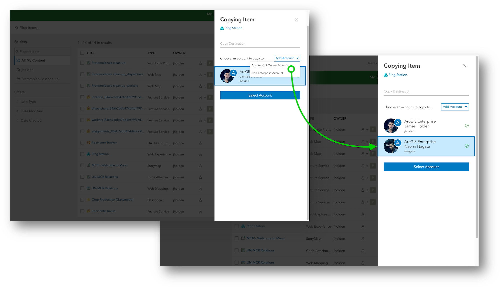
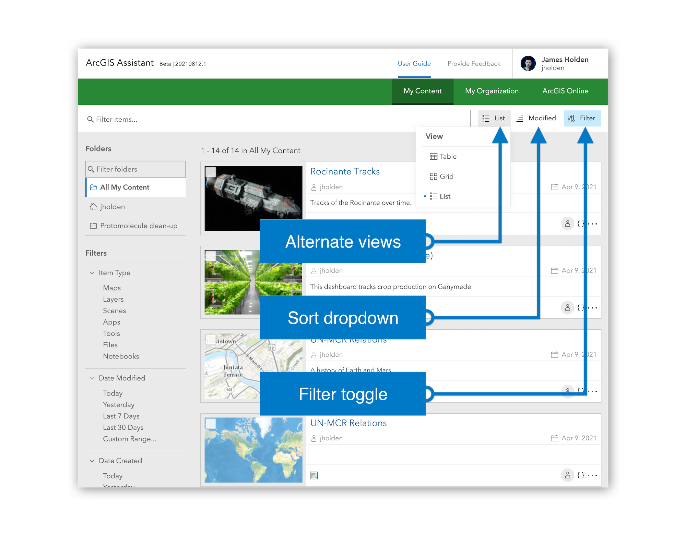

<!-- :::note Intent of this page

This page conveys changes made over time to ArcGIS Assistant to end users.

::: -->

This is the place to check out what's new with ArcGIS Assistant!

## 1 November 2021

### Added
- When copying certain types of items, Assistant will now do its best to update the `url` property for you. Note that this property affects different item types in different ways. This change [is documented here](working-with-items#applications-storymaps-web-experiences-instant-apps-etc), and addresses [#25](https://github.com/EsriPS/arcgis-assistant-feedback/issues/25) and [#26](https://github.com/EsriPS/arcgis-assistant-feedback/issues/26).

- We've added a "Download All" button to the Item Resources page. This handy feature lets you grab a zip file full of all the resources for a particular item.

- You can now edit **XML Item Resources** (just like JSON and text-based) directly in Assistant!

- We've made the "Unable to Access" page a little less frustrating by adding more descriptive text and a handy link back to the Item Browser.

### Changed
- Assistant **no longer appends "copy"** to the end of items created via the Copy Item workflow.

### Fixed
- We fixed an issue where logging in with multiple accounts (across organizations) with the same username was not working properly. This addresses [#21](https://github.com/EsriPS/arcgis-assistant-feedback/issues/21).

- There were a few cases where longer item, user, and organization names would cause ugly overlaps, this should be much better now.

- The Item Browser will now automatically refresh after copying an item (this used to require a manual page refresh).

- The "Cannot Access" message (e.g. for Item Details and Item Data) was showing up sometimes when it should not have been.

- The dialog warning that you might lose unsaved changes only worked when editing Item Details and Item Data. Now it works anywhere you might be making edits to an item (including Item Resources).

- We fixed a bug where cancelling the JSON Editor with unsaved edits sometimes wasn't reverting back to the previous state.

- The JSON Editor's warning modal appeared anytime you clicked "Cancel", now it only happens if you've actually made changes.

## 16 August 2021

👋🏼 Hi friends, its been a while! Luckily the wait was worth it – this is the biggest update to Assistant yet. Full details below, but here are a few highlights:

[**✏️ You can edit Item Resources in the browser!**](#edit-item-resources)

[**👤 You can now add an account during the copy workflow**](#add-account-while-copying)

[**✨ UI updates including item Grid and List views, a new sort dropdown, and a new Item Browser toolbar**](#item-browser-ui-updates)

### Added

#### Edit Item Resources

You can now edit and save `.json` and `.txt` Item Resource files right in the browser. (Addresses [#15](https://github.com/EsriPS/arcgis-assistant-feedback/issues/15))

#### Add account while copying

Before this update, you had to login to any and all accounts you wanted to copy between before actually clicking the Copy Item button. Now, you can just start copying and add the accounts you want to copy to from the Copy Item drawer.

#### Item Browser UI updates

1. Item Browser now has alternate **Grid** and **List** views!

2. Item Browser also has a new **sort dropdown**.

3. You can now **toggle the filter on/off**, and all of these controls (plus the search) have a shiny new home in the Item Browser toolbar.

### Fixed

- When logged in as an admin, editing another user's items was unreliable. (As discussed in [#16](https://github.com/EsriPS/arcgis-assistant-feedback/discussions/16) and [#17](https://github.com/EsriPS/arcgis-assistant-feedback/issues/17))
- A recent change made it so the "Created" date for all items incorrectly displayed the current date. This is fixed.
- Folder sorting was working a little differently in Assistant compared to ArcGIS Online/Enterprise, but now should be the same.
- There was an issue where copying items was leaving the thumbnail behind. This is fixed now 👍🏼
- Another case of the "Open in ArcGIS Online" button working incorrectly when signed into an Enterprise account was taken care of.
- Assistant is set up to support i18n (hit us up if you're interested in contributing some translations!), but the app has always flashed coded property names for a split second before displaying the actual (currently English only) text.

## 25 May 2021

### Fixed

- We fixed an issue where the wrong REST API root URL was being used when querying for items in "My Organization" which resulted in no items displaying on the Content page. This is fixed now, so go explore your org's content to your heart's content.

- When browsing "ArcGIS Online" from the Content page, you may have seen slightly different results than if you went to the Online app and performed the same search. We've fixed this so you should get the same results now.

- We fixed a couple issues with the pagination controls on the Item Resources page. URLs were getting jumbled and pagination was wonky when there were 100+ pages. Should be all good now!

- There was a UI regression at some point that smooshed the item title and icon together on the Content page.

## 11 May 2021

### Added

- If your portal isn't reachable for any reason, Assistant will now display a more useful message. This is particularly handy when you forget to connect to VPN 😅

### Fixed

- The recent ArcGIS Online update introduced some great new capabilities to the ArcGIS REST API! Unfortunately it also broke Assistant's Item Copy workflow in a few different ways... but we've resolved those issues and item copying is back in business 🎉

- There was a bug where you couldn't upload an Item Resource with a `/` in the name. It's fixed 🙂

- Sometimes switching to the "My Organization" view wouldn't display any items (when it definitely should have).

## 30 April 2021

### Added

- You can now create a new folder right from the Copy Item workflow.

### Fixed

#### Enterprise accounts

- Enterprise accounts could see ArcGIS Online items, but not view their Item JSON or Resources. You can now fully interact with Online items from your Enterprise account 🕺🏼

- It wasn't possible to sign in to multiple accounts from the same Enterprise Portal because Assistant was a little too eager to use existing sessions.

- We squashed a bug preventing you from copying Online items into Enterprise accounts.

- Clicking the My Organization tab on the content page sometimes incorrectly displayed no items.

- When signing in to an Enterprise account, there's have a handy tooltip with the URL you need to add as your registered app's Redirect URI... this is now the correct URL 😅 ([#4](https://github.com/EsriPS/arcgis-assistant-feedback/issues/4)).

#### Item Resources

- There was a bug when overwriting Item Resources in nested folders (with a `/` in the name)

- When deleting an Item Resource, the confirmation dialog would ask: _Are you sure you want to delete "undefined"?_... we figured _undefined_ wasn't very useful so we swapped it out for the actual resource name 😄
