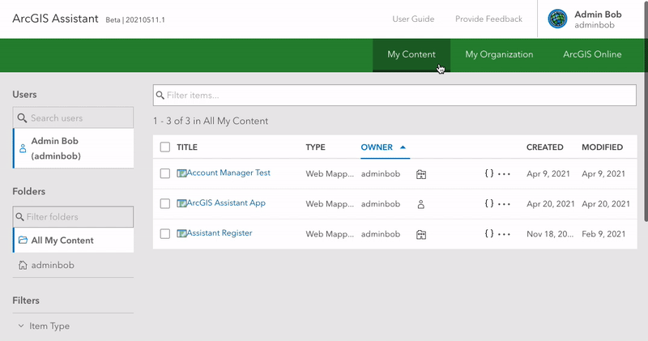
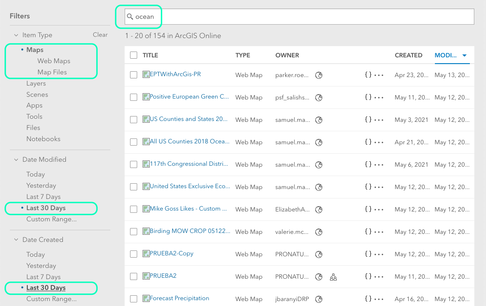
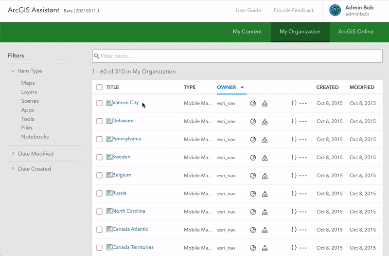
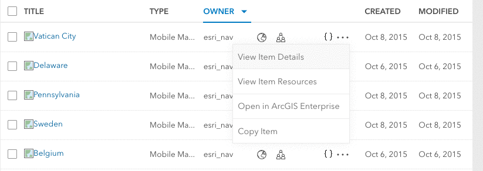

<!-- :::warning Needs media!
This page is ready for screenshots and/or gifs.
::: -->

<!-- :::note Intent of this page

**🏛️ This is a foundational topic.**

This topic should advise users on:

1. Using the Item Browser
2. Using the Item Details drawer

::: -->

The ArcGIS Assistant item browser was built to give you all the same tools you're familiar with from the ArcGIS Online and ArcGIS Enterprise Content page, so you should feel right at home. If you're not familiar, the [Browse and search content](https://doc.arcgis.com/en/arcgis-online/reference/search.htm) page of the ArcGIS Online docs is a good place to start.

## Finding items

After logging into Assistant, you'll probably want to find one or more items to work with. You view items that belong to you (My Content), items that have been shared within your Online or Enterprise organization (My Organization) or items that have been shared publicly (ArcGIS Online).

Just like in ArcGIS Online/Enterprise, you can use the filters on the left of the page to pinpoint the exact items you're looking for. You can also find specific items by name by typing in the "Filter items..." input above the item list.

:::tip

If you're signed in as an organization administrator, you can even select other users from your organization and view their items. [See here for more info](admin-privileges).

:::

## Doing things with items

Once you've found the item(s) you want to work with, there are a few ways to interact with them:

### From the Item Details drawer

Simply click the title of any item to open the Item Details drawer. From here you can access all the actions you can take on that item, such as viewing JSON or copying.

### From the item list

Alternatively, you can take quick action on an item directly from the item list. Each item has a few quick action buttons – note that some may require you to click the ellipsis icon first.

Correlate with ArcGIS Online/Enterprise content page (link to relevant docs)

- Document distinguishing features
  - For administrators (working with other users' items)
  - Item Details drawer
