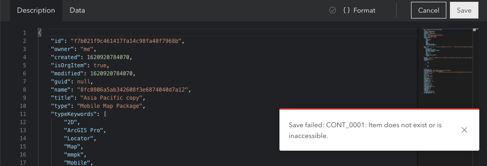

<!-- :::warning Needs media!
This page is ready for screenshots and/or gifs.
::: -->

<!-- :::note Intent of this page

**👉 This is a reference topic.** It's likely that this topic will come up on other pages, we should point them to this page to provide more details.

This page should catalog the known "sharp edges" of using Assistant. While the REST API will protect users from doing things like changing an item's ID property – it won't stop them accidentally deleting all the sections of a Hub Page or widgets of a Dashboard.

::: -->

This guide is meant to point out some potentially destructive things you can do with Assistant. It would be nearly impossible to describe every possible scenario where you could accidentally delete or update something which has unintended consequences.

One of the great things about Assistant is that it provides a bit of a "sandbox" environment to play with the ArcGIS REST API – to test theories, dissect workflows, and generally peek under the hood of ArcGIS.

**That said, the #1 rule of Assistant is to always test new workflows on throwaway items, and be prepared in case you do break something important.**

## Use supported apps!

Assistant will never be designed or intended to supersede any supported workflows in ArcGIS. If you are developing a new workflow that includes viewing or modifying content in ArcGIS – always try to achieve your workflow using supported apps first.

For example, if you simply want to modify an item's title, description, and tags — it is recommended to use the [ArcGIS Online/Enterprise Item Details page](https://doc.arcgis.com/en/arcgis-online/manage-data/item-details.htm#ESRI_SECTION1_D770A2AE32F647DCA47F48622D460B6D).

## Modifying Item Descriptions

[Item Description JSON](working-with-items#item-description) is something you may want to edit in order to update the high-level definition of an item (title, description, tags, etc.). Since the schema for this JSON object is standard across all items, there is only one set of rules to adhere to (unlike [modifying Item Data](#modifying-item-data)). Here are some guideposts:

### Identifying properties

Assistant uses the `id` and `owner` properties to identify the item you're attempting to edit.

> Attempting to edit either of these properties will result in an error and **no updates will be applied**.

### Where ArcGIS helps you out

#### Read-only properties

Some properties are always read-only. This means that even if you try to edit them from Assistant (or any other client using the ArcGIS REST API), your edits will just be ignored. Read-only properties are typically those you'd expect to be controlled or derived by the system, such as `type`, `created`, `modified`, and `size`.

> Attempting to edit any of these properties will not result in an error, but the **changes to these properties will not be applied**.

#### Type coercion

Most properties expect to be provided a specific data type (typically a string, number, boolean, or array). In some cases, the ArcGIS REST API will coerce an incorrect data type for you. For example, the `description` property expects a string – if you provide a number like `743` it will be coerced to the string `"743"`.

> Attempting to edit any of these properties with an incorrect data type may result in **the value being coerced to the correct data type automatically**.

## Modifying Item Data

Unlike Item Descriptions, Item Data does not follow a standard schema for all item types. This means the rules change depending on the type of item you're working with. If we use the analogy of modifying files on your computer – editing an Item's Description is a bit like changing a file's name or sharing permissions; editing an Item's Data is like opening the file and changing its contents, which has the potential to be far more destructive if you don't know how to work with that type of file.

The #1 rule of Assistant is maybe more relevant here than anywhere: **test your changes on a throwaway item and understand the effects before trying it on an important item!**

### Web maps, scenes, and apps

While some item types are mostly just a pointer to another data source (feature services, for example), other item types rely heavily or solely on Item Data. These types of items are particularly interesting to explore in Assistant, and include (but are not limited to) web maps, web scenes, and many of the apps you can build with ArcGIS (StoryMaps, Dashboards, Web Experiences, etc.).

There are far fewer guard rails when editing Item Data as compared to Item Descriptions, which makes it much easier to accidentally break things.

Take a Dashboard item, for example. A Dashboard's Item Data is a JSON object that describes nearly every aspect of its configuration: widgets, layout, theme, the header panel, and other settings. For the most part, you are allowed to edit any aspects of this JSON object. If you delete co-dependent widgets, use an invalid string to describe the orientation of a layout element, or accidentally delete the `version` property, you won't see any warnings or errors in Assistant, but there's a high likelihood your Dashboard will be irreversibly broken.

<!--

-->
