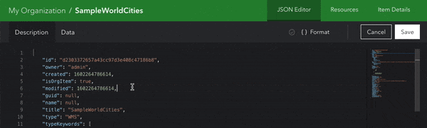
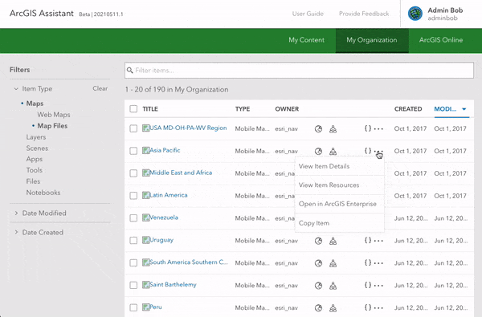

<!-- :::warning Needs media!
This page is ready for screenshots and/or gifs.
::: -->

<!-- :::note Intent of this page

**🏛️ This is a foundational topic.**

This topic should advise users on:

1. Working with Item JSON (description + data)
2. Working with Item Resources
3. Copying Items _-- does this deserve its own article/page?_

::: -->

If you're familiar with ArcGIS Online or Enterprise, then you know you can create content like maps, layers, and apps. These are generically referred to as "items", and ArcGIS supports many unique types of items. If you would like to learn more, check out the [Items and item types](https://developers.arcgis.com/rest/users-groups-and-items/items-and-item-types.htm) topic in the ArcGIS REST API docs.

At a high level, ArcGIS Assistant focuses on letting you work with items in 3 ways:

1. [View and modify Item JSON](#working-with-item-json)
2. [View and modify Item Resources](#working-with-item-resources)
3. [Copy items](#copying-items)

Keep reading this guide to learn about each of these capabilities.

## Working with Item JSON

Items in ArcGIS are represented by JSON. Every item includes what we'll refer to as the "Item Description" while a subset of items also have a child resource that we'll call "Item Data", which may be JSON or another type of data.

You can view and modify (if your account has permission) Item JSON by clicking "View Item JSON" from the [Item Details drawer](finding-items#from-the-item-details-drawer) or from the action menu in the [item list](finding-items#from-the-item-list).

### Item Description

Every item is defined by a JSON object which follows a standard schema. This object defines the basic properties of items like `title`, `owner`, `tags`, and more. For a full reference of the properties you can expect in this JSON object, see the ArcGIS REST API topic for [Item](https://developers.arcgis.com/rest/users-groups-and-items/item.htm).

### Item Data

Most item types contain Item Data, which describes the data contained within or referenced by that item. The most common type of data for Item Data is JSON – but there are many item types that contain other data formats. The table on the ArcGIS REST API [Items and item types](https://developers.arcgis.com/rest/users-groups-and-items/items-and-item-types.htm) topic displays this format for every item type in ArcGIS.

:::note

ArcGIS Assistant currently only supports editing Text/JSON Item Data.

:::

### Using the editor

If you have editing privileges for an item, you can begin editing by clicking the "Edit JSON" button above the editor window. Any edits made will not be persisted to ArcGIS Online/Enterprise until you click "Save", and you can click "Cancel" at any time to discard your changes.

Assistant includes [Monaco Editor](https://microsoft.github.io/monaco-editor/), the code editor that powers [VS Code](https://github.com/Microsoft/vscode). This means you can use some pretty advanced features like [Multiple selections](https://code.visualstudio.com/docs/editor/codebasics#_multiple-selections-multicursor), [Folding](https://code.visualstudio.com/docs/editor/codebasics#_folding), [Go To Symbol](https://code.visualstudio.com/docs/editor/editingevolved#_go-to-symbol), and a lot more.

## Working with Item Resources

Certain types of items in ArcGIS may have files associated to them, these are called Item Resources.

:::tip

For a list of items that support Item Resources as well as information on file limitations, visit the ArcGIS REST API's [Add Resources](https://developers.arcgis.com/rest/users-groups-and-items/add-resources.htm) topic.

:::

You can view and modify (if your account has permission) Item Resources by clicking "View Item Resources" from the [Item Details drawer](finding-items#from-the-item-details-drawer) or from the action menu in the [item list](finding-items#from-the-item-list).

## Copying items

Another workflow ArcGIS Assistant enables is copying items. You can copy items with a single account, across accounts in an organization, or even across organizations (including between ArcGIS Online and ArcGIS Enterprise).

You can start the item copying workflow by clicking "Copy Item" from the [Item Details drawer](finding-items#from-the-item-details-drawer) or from the action menu in the [item list](finding-items#from-the-item-list).

### Copy destination

:::tip

If the destination account is an organization administrator, you will have the option to [choose any user in that organization](admin-privileges#copying-to-another-users-account) as the copy destination.

:::

### Supported item types

Copying items in ArcGIS Online/Enterprise is straightforward for some item types (like [web maps](https://doc.arcgis.com/en/arcgis-online/reference/what-is-web-map.htm)), a little more complex for others (like [Web Experiences](https://www.esri.com/en-us/arcgis/products/arcgis-experience-builder/resources) and [StoryMaps](https://www.esri.com/en-us/arcgis/products/arcgis-storymaps/resources)), and much more complex for yet others (like [feature layers](https://doc.arcgis.com/en/arcgis-online/reference/feature-layers.htm)). For this reason, ArcGIS Assistant does not support copying for all item types, below is a reference.

#### Applications (StoryMaps, Web Experiences, Instant Apps, etc.)

[Web application item types](https://developers.arcgis.com/rest/users-groups-and-items/items-and-item-types.htm#ESRI_SECTION2_FDC9D85D0CF4492082434406739EF158) may depend upon the url property of the item for editing and viewing. Assistant will attempt to update the url property during the copy but may not handle every scenario, especially when copying between ArcGIS Online and ArcGIS Enterprise accounts. Manual review and update of the url property may be needed until the copy functionality is further enhanced.

#### Services (Feature Service, Map Service, Image Service, etc.)

Assistant currently supports _copying services by reference_. This means the item will be copied, but the underlying data source (e.g. the FeatureServer, MapServer, ImageServer, etc.) will still be referenced. If you're familiar with the old AGO-Assistant, this was referred to as a "Simple" copy.

:::note

Cloning or full copying of certain types of services is on our roadmap.

:::
